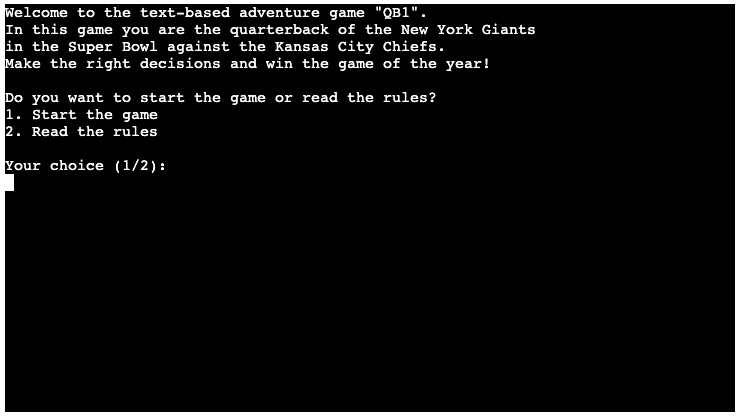
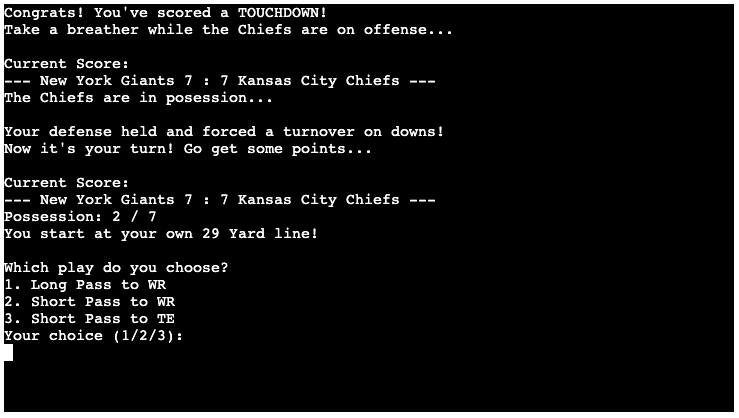

# [TEXTBASED QUARTERBACK GAME](https://textbased-quarterback-game-fcaaa3679ab0.herokuapp.com)

Textbased Quarterback Game is an engaging and strategic text-based simulation game that puts you in the shoes of a quarterback. As the quarterback, you make critical decisions on the field, leading your team to victory. The game focuses on the strategic aspects of football, allowing you to choose plays, make split-second decisions, and experience the thrill of the game.

## UX
Welcome to the immersive world of QB1, where you become the quarterback for the New York Giants in the Super Bowl showdown against the Kansas City Chiefs. To ensure an enjoyable user experience, I've incorporated deliberate time delays using `time.sleep(2)` to prevent information overload and keep you engaged at every step.

Throughout the game, you'll find yourself in the midst of intense moments, with a scoreboard providing real-time updates on the score and possession counters keeping you informed about the game's progress. Decision-making is key, and your choices, such as selecting plays and calling coin tosses, will shape the destiny of your team.

Strategic elements like the last possession and overtime scenarios add an extra layer of excitement. Witness the final scores, complete with congratulatory messages for victories or encouraging words in case of a setback. When the game concludes, easily navigate back to the main menu for a swift replay.

QB1 is not just a game; it's an experience crafted with your enjoyment in mind. Your feedback is invaluable, so let's dive into the world of QB1 and create memorable adventures on the virtual gridiron!

## User Stories

### New Site Users

- As a new site user, I want to easily understand how to play the game so that I can start enjoying it quickly.
- As a new site user, I want clear instructions on how to make decisions in the game so that I can play effectively.
- As a new site user, I want an engaging and immersive experience while playing the game.
- As a new site user, I want feedback on my decisions so that I can learn and improve my gameplay.
- As a new site user, I want the game to be challenging and dynamic, providing a sense of accomplishment when I succeed.

### Returning Site Users
- As a returning site user, I want to play the game again, with different outcomes
- As a returning site user, I want to explain the game to my friends (rules provided)

## Features

### Existing Features

| Feature | About | Image |
| --- | --- | --- |
| Start Menu Navigation | This feature introduces the user to the game and gives them the choice between reading through the rules and navigating to the start of the game. |  |
| The Rulebook & Navigation | Once the user has read through the rules, he can simply navigate out of the rules area with this future and decide to start the game or return to the main menu. |  |
| The Cointoss (Start of the game & Overtime) | The coin toss at the start of the game decides which team gets the ball first and draws the user directly into the game with interactivity. |  |
| The Scoreboard | The scoreboard ensures that the user has an overview of the game progress at the start of each possession. |  |
| User Possession Counter | The game ends after 7 user possessions. With the counter, the user is informed at the beginning of each possession about how many possessions they have left to win the game. |  |
| Field Position | The Field Position ensures that the game feels more realistic and diverse by informing the user, before each possession, about where the drive starts on the field. |  |
| User Quarterback Decision Making | This feature is the main part of the game. The user acts as the quarterback and chooses between 3 plays in each turn. The outcome of these plays is left to chance, placing the user in new situations each time. |  |
| End of Game Navigation | This feature ensures that when the game is over, the user is returned to the main menu, allowing them to start anew if they wish. |  |

### Future Features

- Implement game history and statistics to track progress for returning site users.
- A chance to select between several teams to play with.
- Resolve field position inconsistency for users starting at the opponent's territory; ensure accurate touchdown calculations after gaining multiple first downs. ([Read more in TESTING.md - Unfixed Bugs](TESTING.md#unfixed-bugs))

## Tools & Technologies Used

- [Python](https://www.python.org) used as the back-end programming language.
- [Git](https://git-scm.com) used for version control. (`git add`, `git commit`, `git push`)
- [GitHub](https://github.com) used for secure online code storage.
- [Gitpod](https://gitpod.io) used as a cloud-based IDE for development.
- [Heroku](https://www.heroku.com) used for hosting the deployed back-end site.

## Data Model

### Flowchart

### Functions

The primary functions used on this application are:

| Function | What it does |
| --- | --- |
| `welcome()` | Function to display the menu of the game and welcome the sites user. |
| `user_choice_welcome()` | Function to let user decide between starting the game or reading the rules. |
| `game_rules()` | Function to display rules and let user decide if he wants do get back to menu or start game directly (navigation function). |
| `game_rules_navigation()` | Function to let user navigate back to the main menu or start the game while in the rules. |
| `start_game()` | Function to start the game. The game starts with the first decission: the cointoss! |
| `cointoss_start_game()` | Function to start the game with the first decission: the cointoss! |
| `chiefs_posession()` | Function when chiefs are in posession. USER HAS NO CONTROL! |
| `giants_possession()` | Function when the Giants (The User) is in possession of the ball with random starting position and yard line. |
| `giants_posession_choose_play()` | Function for user to decide what play to be played. |
| `end_game()` | Function for the end of the game. |
| `start_overtime()` | Function for overtime to start, when game ended in a draw. |
| `chiefs_posession_overtime()` | Function for chiefs possession in overtime. |
| `giants_possession_overtime()` | Function for the user possession to start. |
| `giants_posession_choose_play_overtime()` | Function for the user Quarterback choices in overtime. |
| `coin_toss_overtime()` | Function for the cointoss in overtime. |
| `end_game_after_overtime()` | Function to end the game after overtime. |
| `end_game_navigation ()` | Function to let user navigate back to the main menu. |

### Imports

I've used the following Python packages and/or external imported packages.

- `time`: used for delayed responses for better user overview
- `random`: used for random scenario outcomes in the game
- `os`: used to clear the screen for better user overview
- `colorama`: used to highlight text for better user overview

## Testing

For all testing, please refer to the [TESTING.md](TESTING.md) file.

## Deployment

Code Institute has provided a [template](https://github.com/Code-Institute-Org/python-essentials-template) to display the terminal view of this backend application in a modern web browser.
This is to improve the accessibility of the project to others.

The live deployed application can be found deployed on [Heroku](https://textbased-quarterback-game-fcaaa3679ab0.herokuapp.com).

### Heroku Deployment

This project uses [Heroku](https://www.heroku.com), a platform as a service (PaaS) that enables developers to build, run, and operate applications entirely in the cloud.

Deployment steps are as follows, after account setup:

- Select **New** in the top-right corner of your Heroku Dashboard, and select **Create new app** from the dropdown menu.
- Your app name must be unique, and then choose a region closest to you (EU or USA), and finally, select **Create App**.
- From the new app **Settings**, click **Reveal Config Vars**, and set the value of KEY to `PORT`, and the value to `8000` then select *add*.
- Further down, to support dependencies, select **Add Buildpack**.
- The order of the buildpacks is important, select `Python` first, then `Node.js` second. (if they are not in this order, you can drag them to rearrange them)

Heroku needs two additional files in order to deploy properly.

- requirements.txt
- Procfile

You can install this project's **requirements** (where applicable) using:

- `pip3 install -r requirements.txt`

If you have your own packages that have been installed, then the requirements file needs updated using:

- `pip3 freeze --local > requirements.txt`

The **Procfile** can be created with the following command:

- `echo web: node index.js > Procfile`

For Heroku deployment, follow these steps to connect your own GitHub repository to the newly created app:

Either:

- Select **Automatic Deployment** from the Heroku app.

Or:

- In the Terminal/CLI, connect to Heroku using this command: `heroku login -i`
- Set the remote for Heroku: `heroku git:remote -a app_name` (replace *app_name* with your app name)
- After performing the standard Git `add`, `commit`, and `push` to GitHub, you can now type:
	- `git push heroku main`

The frontend terminal should now be connected and deployed to Heroku!

### Local Deployment

This project can be cloned or forked in order to make a local copy on your own system.

For either method, you will need to install any applicable packages found within the *requirements.txt* file.

- `pip3 install -r requirements.txt`.

#### Cloning

You can clone the repository by following these steps:

1. Go to the [GitHub repository](https://github.com/firstnamejonas/textbased-quarterback-game) 
2. Locate the Code button above the list of files and click it 
3. Select if you prefer to clone using HTTPS, SSH, or GitHub CLI and click the copy button to copy the URL to your clipboard
4. Open Git Bash or Terminal
5. Change the current working directory to the one where you want the cloned directory
6. In your IDE Terminal, type the following command to clone my repository:
	- `git clone https://github.com/firstnamejonas/textbased-quarterback-game.git`
7. Press Enter to create your local clone.

Alternatively, if using Gitpod, you can click below to create your own workspace using this repository.

Please note that in order to directly open the project in Gitpod, you need to have the browser extension installed.
A tutorial on how to do that can be found [here](https://www.gitpod.io/docs/configure/user-settings/browser-extension).

#### Forking

By forking the GitHub Repository, we make a copy of the original repository on our GitHub account to view and/or make changes without affecting the original owner's repository.
You can fork this repository by using the following steps:

1. Log in to GitHub and locate the [GitHub Repository](https://github.com/firstnamejonas/textbased-quarterback-game)
2. At the top of the Repository (not top of page) just above the "Settings" Button on the menu, locate the "Fork" Button.
3. Once clicked, you should now have a copy of the original repository in your own GitHub account!

### Local VS Deployment

The local version may have additional debug features enabled for testing purposes. It's recommended to use the deployed version for the best user experience.

## Credits

### Content

| Source | Usage |
| --- | --- |
| [W3Schools](https://www.w3schools.com) | for various tutorials on Python |
| [YouTube](https://www.youtube.com) | for tutorials on game development concepts. |
| [YouTube](https://www.youtube.com/watch?v=u51Zjlnui4Y) | for tutorials on how to use and implement colorama. |
| [WikiHow](https://www.wikihow.com/Write-a-Coin-Flipping-Program-on-Python) | for tutorial on how to implement the cointoss into the game |
| [DigitalOcean](https://www.digitalocean.com/community/tutorials/python-time-sleep) | for time.sleep() function to hold back responses for a better user overview |
| [StackOverflow](https://stackoverflow.com/questions/46820182/randomly-generate-1-or-1-positive-or-negative-integer) | for implementation of randomly generated scenario outcome |
| [GeeksForGeeks](https://www.geeksforgeeks.org/clear-screen-python/) | used for clear-function for better user overview |

### Acknowledgements

- I would like to thank my family & my partner Caro, for believing in me, and allowing me to make this transition into software development.
- I would like to thank my Code Institute mentor, [Tim Nelson](https://github.com/TravelTimN) for his support throughout the development of this project, giving me confidence and valuable advice!
- I would like to thank the [Code Institute Slack community](https://code-institute-room.slack.com) for the moral support; it kept me going.
