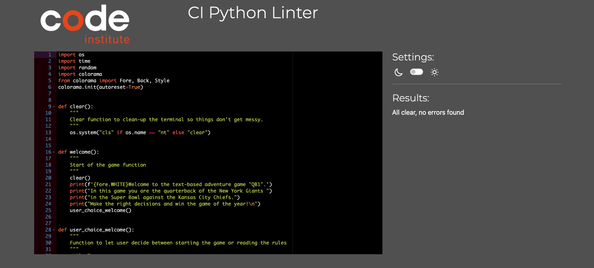
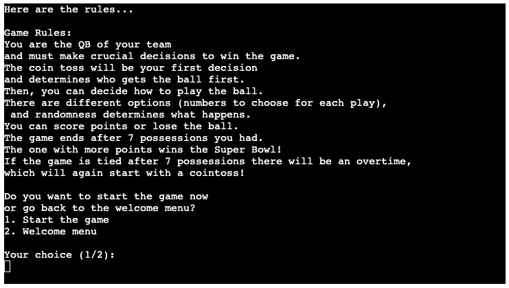
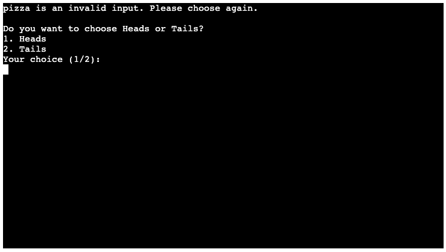
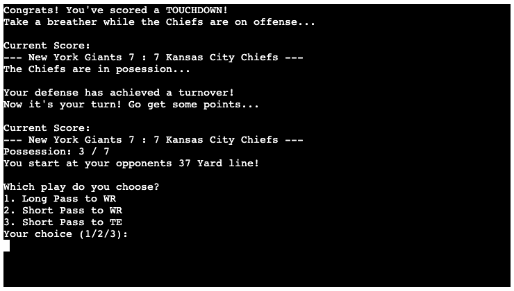
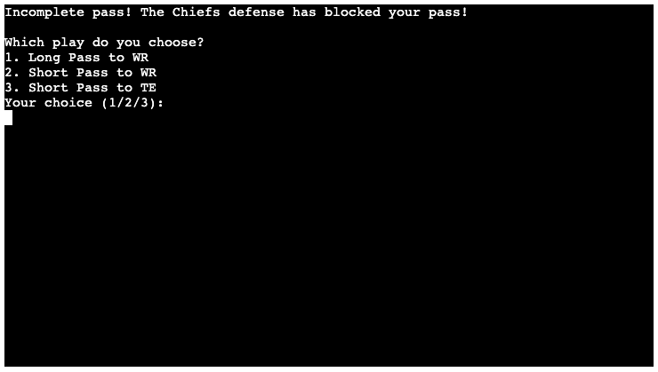

# Testing

Return back to the [README.md](README.md) file.

In this section, I aim to demonstrate the thorough testing conducted to ensure the reliability and functionality of the [Textbased Quarterback Game](https://textbased-quarterback-game-fcaaa3679ab0.herokuapp.com/). The primary goal is to check that the site works seamlessly, providing users with an intuitive experience to achieve their user goals.

## Code Validation

### Python

I have used the recommended [PEP8 CI Python Linter](https://pep8ci.herokuapp.com) to validate all of my Python files.

| File | CI URL | Screenshot | Notes |
| --- | --- | --- | --- |
| run.py | [PEP8 CI](https://pep8ci.herokuapp.com/https://raw.githubusercontent.com/firstnamejonas/textbased-quarterback-game/main/run.py) |  | All clear, no errors found. |

## Browser Compatibility

I've tested my deployed project on multiple browsers to check for compatibility issues.

| Browser | App | Notes |
| --- | --- | --- |
| Chrome |  | Works as expected! |
| Firefox |  | Works as expected! |
| Safari |  | Due to a commonly known Bug no user input is possible in this Browser. |

## Defensive Programming

Defensive programming was manually tested with the below user acceptance testing:

| Feature | Expectation | Test | Result | Fix | Screenshot |
| --- | --- | --- | --- | --- | --- |
| Start Menu Navigation | Feature is expected to navigate the user to the game rules or to the start of the game when the user input is 1 / 2. If the user types anything else, then the app will send an invalid input message. | Tested the feature by typing 1, 2, 3 & pizza. | The feature behaved as expected | Test concluded and passed |  |
| The Rulebook & Navigation | Feature is expected to navigate the user back to the main menu or to the start of the game when the user input is 1 / 2. If the user types anything else, then the app will send an invalid input message. | Tested the feature by typing 1, 2, 3 & pizza. | The feature behaved as expected | Test concluded and passed |  |
| The Cointoss (Start of the game & Overtime) | The feature is there to determine which player is in possession of the ball first. If the user enters 1 / 2, it is randomly decided who gets the ball first, the user is informed and can then either start or wait until the Chiefs possession is over. If the user enters values other than 1 / 2, he receives an error message that the entered value is not valid. | Tested the feature by typing 1, 2, 3 & pizza. | The feature behaved as expected | Test concluded and passed |  |
| The Scoreboard | The current score is displayed before each possession so that the user is always up to date with the result of the game. The feature is expected to display the score before each possession and to update the score depending on the outcome of the last possession. | Tested the feature by scoring a Touchdown and not scoring a Touchdown. | The feature behaved as expected | Test concluded and passed |  |
| User Possession Counter | The possession counter feature is expected to count the user's possessions. The game lasts 7 user possessions and at the last possession the counter should disappear and a message should be displayed informing the user that this is his last possession | Tested the feature by playing through all 7 possessions. | The feature behaved as expected | Test concluded and passed |  |
| Field Position | The feature is expected to output a random field position at the beginning of each user possession, where the user starts his drive. | Tested the feature by playing through all 7 possessions. | The feature behaved as expected | Test concluded and passed |  |
| User Quarterback Decision Making | The feature is expected to output a result when the user selects option 1 / 2 / 3 depending on the probability whether the pass led to a touchdown, an interception, an incomplete pass or a complete pass. If the user specifies values other than 1 / 2 / 3, a message is displayed that the input is invalid and the user must select again. | Tested the feature by typing 1, 2, 3, 4 & pizza. | The feature behaved as expected | Test concluded and passed |  |
| End of Game Navigation | The feature is expected to be displayed at the end of the game (both after regular time if the game does not end in a draw and after overtime if the game ends in a draw). The user can put in 1 to end the game and is sent back to the start menu. If the user enters other values, he receives an error message and has to enter the value again. | Tested the feature by typing 1, 2 & pizza. | The feature behaved as expected | Test concluded and passed |  |

## User Story Testing

| User Story | Screenshot / Explanation |
| --- | --- |
| As a new site user, I want to easily understand how to play the game so that I can start enjoying it quickly. | Easy to understand rulebook & navigation with only minimum amount of numbers|
| As a new site user, I want clear instructions on how to make decisions in the game so that I can play effectively. |  |
| As a new site user, I want an engaging and immersive experience while playing the game. | Different field positions, random play outcomes, the user is always engaged  and does not know what is up next for him. Plus he is in full control over his play calling. |
| As a new site user, I want feedback on my decisions so that I can learn and improve my gameplay. | Direct feedback after every pass made with information on what the outcome was on the play. |
| As a new site user, I want the game to be challenging and dynamic, providing a sense of accomplishment when I succeed. | Due to random results the score is always up to multiple outcomes, which gives the user the feeling of success if the user wins. |
| As a returning site user, I want to play the game again, with different outcomes | Due to random outcomes on plays, scores and more, the outcomes will always be different |
| As a returning site user, I want to explain the game to my friends (rules provided) |  |

## Bugs

| Bug | Bug Image | Fixed Bug | Fixed Bug Image |
| --- | --- | --- | --- |
| The feature (possession counter) is expected to end possession after 4 incompletions in a row and give the Chiefs possession of the ball. It did not (see picture below). |  | To fix this, I have made the variable consecutive_incomplete_pass a global variable, as otherwise it would be overwritten again and again. |  |
|The terminal gave an error message when trying to implement the scoreboard so that it is displayed before each team possession. |   | To fix this, I have specified the variables as global in the function, so that the function knows what it has to access. |  |
| Since it's the Super Bowl, the game can't end in a tie like the picture below. |  | To fix this, I have added functions, that are displaying an overtime, with the first team to score winning the game. |  |
| If the user decides to restart the game after finishing it, the variables still had values saved from the previous game and the score was not reset to 0 : 0, for example. |  | To fix this, I have add resets to the end_game_navigation function for the necessary variables. |  |
| Python Validation Error: E501 line too long (103 > 79 characters). Lines: 164, 199, 392, 607 |  | Fixed it by splitting the code up into multiple lines. |  |

## Unfixed Bugs

Python Validation Error: E501 line too long (103 > 79 characters).
Lines: 164, 199, 392, 607
- I haven't fixed these bugs because they don't affect the game's visibility. However, if I were to change these bugs, it would lead to a poorer user experience

    

There are no remaining bugs that I am aware of.
